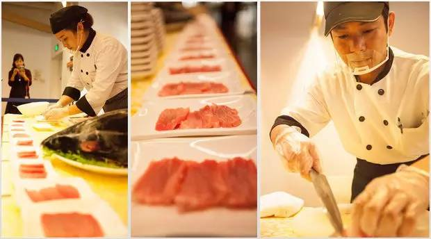

#学生党如何拿到阿里技术offer：《阿里面试（失败）》

今天和大家分享的这篇博文的作者经历了阿里的校招面试，但是遗憾的是他最终未能成功拿到阿里的技术offer，甚至都没有机会能参加二面，也就是说在一面的时候就已经被pass掉了。我之所以给大家看这篇失败的经历，是想告诉大家“机遇只会青睐有准备的人”，当自己的技术能力还不够时，那么就潜心下来积累，编程能力欠缺就练习编程，知识储备不足就看书，看技术博客，向比你优秀的人学习。面试失败不是因为其他原因，其实就是自己的能力还没有达到面试官的要求。
 

从这位学长失败的经历，我们可以看出，我们学习知识也好，专业技能也好，不能将问题的研究停留于表面，而应该看的更加深刻，更加透彻一些。最好对知识技术问题有自己独特的见解，这样才能称之为“有料”，心中有料，自信自然便有了。

 

总之，对于技术的研究，功夫用在平时。有一句话叫做“博观而约取，厚积而薄发”。这句话对于我们而言也值得细细品味其中的道理。

 

好了，正文如下：

《阿里面试（失败）》

 

从上次阿里笔试说起。之前去清华参加算法工程师的笔试，好多都不会做，做完之后感觉自己没多大希望了……之后听到两个老队友已经收到面试通知了，真心为他们感到高兴。自己却没收到通知，想想应该也就没有机会了；不过还是很欣慰，因为做了自己想做的事，尝试去做了，跟着自己的心走就一件快乐的事情！

不过幸运总是从天而降，晚上我接到了来自阿里（北京）的电话。

第二天8点出发，10：30左右来到了国家广告产业园区。果然高大上，在A座一楼玻璃窗上贴满了阿里巴巴、淘宝、天猫等图标……签到之后在大厅里等候，里面的各种零食可以随便吃。通知里说11:30面试，但是直到12点吃饭的时间还没到我。我还以为中午就要靠吃这些饼干充饥了，没想过阿里还贴心地给我们准备了午餐。也因为吃饭，错过了面试时间，又要等到下一批了。

（PS：编者添加，说起阿里的伙食…图为马云大大“双十一”给阿里员工直接从日本买的金枪鱼…你说阿里的员工幸福不幸福…）

 

到我面试时已经2点了，面试我的是一个三十来岁的中年人，他看了一下我的简历，可能觉得我是一个本科生，试卷又不是做的很好，说我的理论功底不够，面试算法的话希望不大。他说根据我做的这些项目，说我比较适合去研发工程师。我说想想，他说算法这边可要求比较高，理论要比较强，看你自己的想法，是想在这里面试，还是到研发工程师去。后来我说我个人对算法比较感兴趣，但是我可以作为一种爱好来学，以后我还是继续研究的，可以到研发工程师那边去面试一下。

Java研发工程师那边人更多啊！在那边等了有一两个小时，轮到我时已经是四点左右了。面试官是一个年轻人，知道我是从算法那边转过来的，他问我在那边有没有面试过，我说没有(现在后悔，当初应该说在那边简单面试了一下，觉得我比较适合做研发工程师)。

 

在看了我的简历之后，问几个跟专业关系不大的问题(比如你学校是江西的，怎么跑到北京来面试？)之后，首先问了我对面向对象的理解，因为是我从算法转过来的，也没准备过，就根据自己的理解来答。我回答面向对象是针对对象进行编程，就比如说一个，他由手和脚等各部分组成，就像……它和面向过程的区别是……，后来他说不是这个意思，不用举例，你就用概括性的语言总结一下，我不知道该怎么回答，就说了面向对象的特性：继承、封装、多态……他一听到继承，就问继承有什么用，你在做过的项目中哪里用过继承？我说在我上一个项目中写图像搜索算法的时候用过，用父类定义一个统一的方法，然后有两种不同的图像搜索算法继承它。他说为什么不再写一个类去调用这些方法，我说那就是类的组合了，就像代理一样。紧接着又问继承和组合哪个好，我说他们有各自不同的使用场合；他就说，对，那什么时候用组合，什么时候用继承。后面我的回答不太好。

之后他看了我的简历，看到在专业技能里写的一栏“熟悉Java的IO流机制”，他就说你对IO比较了解是吧，写过文件存储吗？我说写过。后来他就现场要我写一个程序：有一个int类型的数据要保存到一个文件里，然后从文件里取出来之后加1之后再保存起来，然后再加1再保存。我写了两个方法一个write，一个read，reaer里用BufferedReader类来读，write类里用BufferedWriter类来写。写完之后他看了一下，他说用bw.write()，写入的时候，已经存在一行数据，你再写入一行，不是到了第二行了吗？我也不确定是不是这样，因为平时写的时候都现场去查API，但这时没有API给你查，然后我就说，可能我这个类用的不太好，可以用DataOutputStream，一个字节一个字节地往里写。他说用DataOutputStream不也是写在下面一行吗?你怎样解决这个问题？我说不会，用这个类的话它会自动覆盖文件之前的内容。他问是吗？它问覆盖之前的内容吗？我又思考了一下，然后还是肯定地回答“是！”.然后他沉默了，没再问。

 

后面还问我对Java web熟悉吗？我说不熟悉，就没再问了;还问会linux吗？我说会一些简单的命令，他说会查看系统的访问量吗？我说不会。后面还问了几个问题，不记得了。

最后他说我编程能力还行，叫我保持电话联系，他说他们再考虑一下。

后来打听到，一面通过的就立马直接进入下场面试了(也就是二面)，二面过了就基本上确定留下来了，看来我基本上没有多大希望了……

总结：

1、面试看的最多的是你的专业技能和做过的项目，其它的基本不看，所以在简历里，把这两项放在最前面；

2、简历里不要写太多你会什么，来会的你就不要写，不然问你答不出来就更糟糕了；

3、面试官会针对你的回答一个一个询问下去，所以答的时候，一定要往自己会的方面答，不要扯太多没有用的东西，不然他可能会逐渐询问下去。

详情链接：https://yq.aliyun.com/articles/6824?spm=a2c4e.11153940.blogcont6807.17.63cf2380HaBSu3